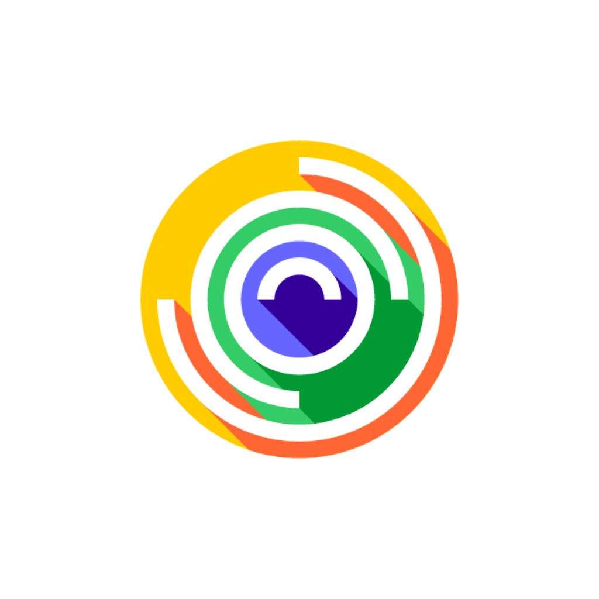
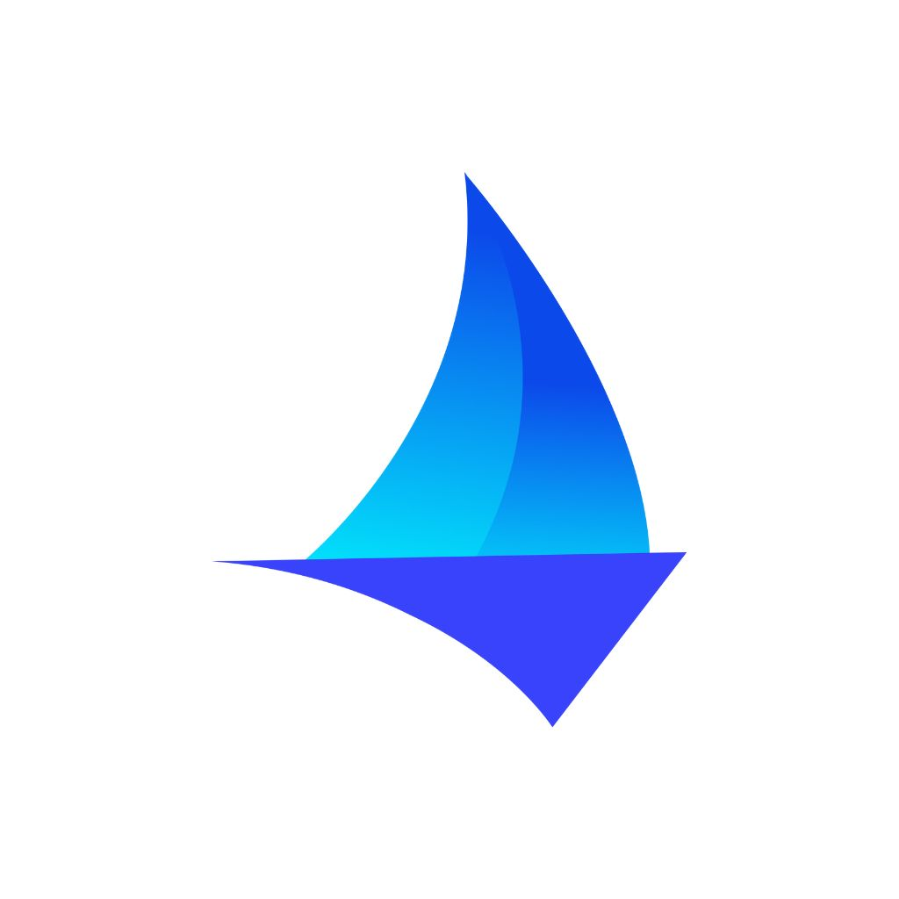

# Hey, I'm Rob

📍 **Austin, TX** · Senior Software Engineer @ **[Nash](https://nash.ai)** · Ex-Amazon/AWS

---

I think about systems—how they move, break, and scale.

I work on logistics infrastructure at [Nash](https://nash.ai). Outside of that, I'm building things across robotics, autonomous systems, game theory, and the human side of tech.

### Currently

<table>
  <tr>
    <td valign="middle"></td>
    <td valign="middle"><strong><a href="https://nash.ai">Nash</a></strong> — Last-mile logistics infrastructure</td>
  </tr>
  <tr>
    <td valign="middle"></td>
    <td valign="middle"><strong><a href="https://github.com/aeon-entertainment">Aeon Entertainment</a></strong> — Making karaoke less stuck in 2005</td>
  </tr>
  <tr>
    <td valign="middle"></td>
    <td valign="middle"><strong><a href="https://github.com/altoal">Altoal</a></strong> — Where I build what I'm curious about</td>
  </tr>
</table>

### Previously

<table>
  <tr>
    <td valign="middle"></td>
    <td valign="middle"><strong><a href="https://amazon.com">Amazon</a></strong> — ~5 years across InfoSec and AWS Marketplace</td>
  </tr>
</table>

### Projects

Coming soon.

---

### Connect

---

A few things

- Too many browser tabs open
- Interested in: autonomous fleets, geopolitics, game theory, sociology
- The "world's greatest" is a bit aspirational

